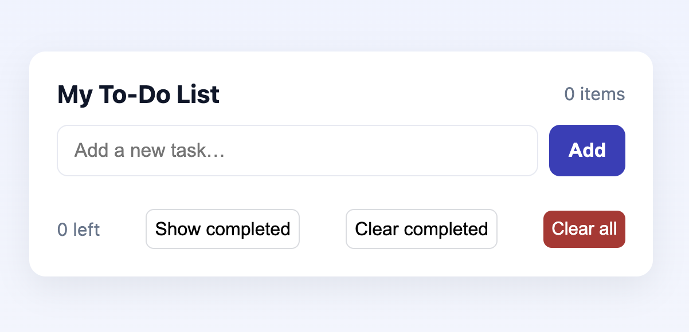
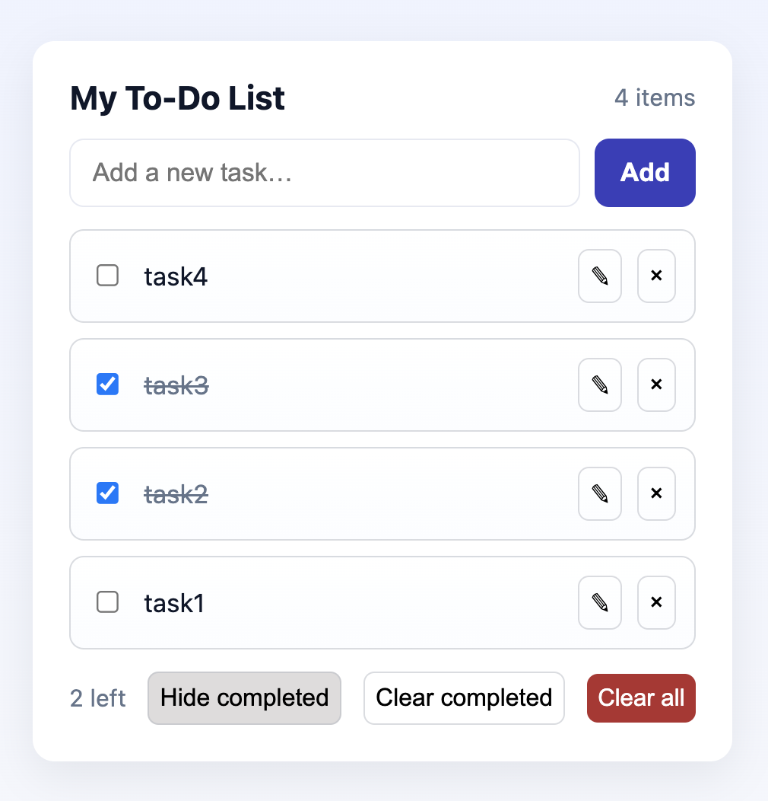
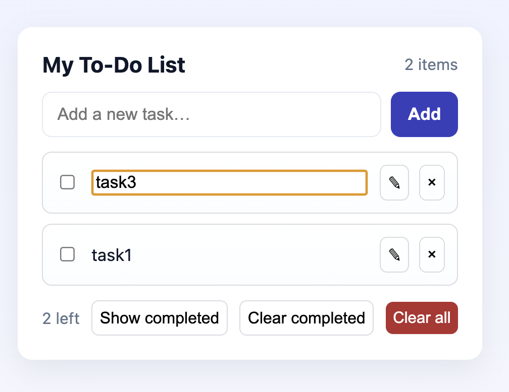

# todo-app

This is what the app looks like on start:

You can add your tasks in the text bar via clicking the Add button or pressing enter.

Checkmarked items are automatically hidden from view when clicked but can be unhidden by clicking the 'Show completed' button.

Tasks can be edited via the pencil icon on the right side of the text.

Items can be removed individually via the 'x' or the 'Clear all' button.